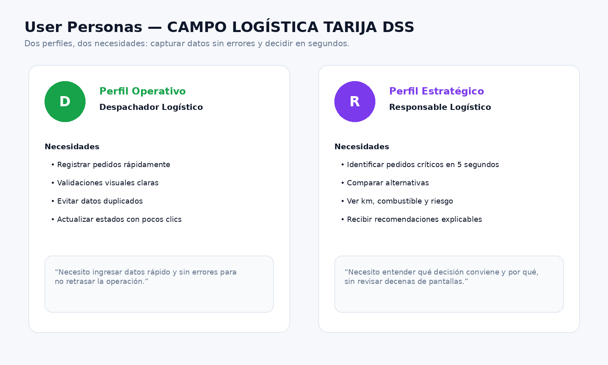
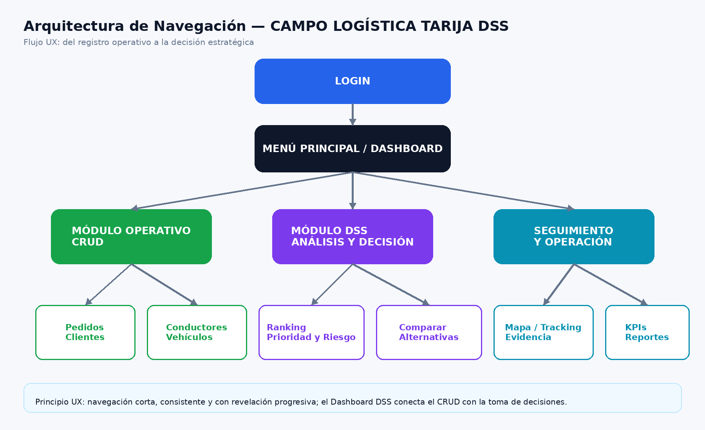
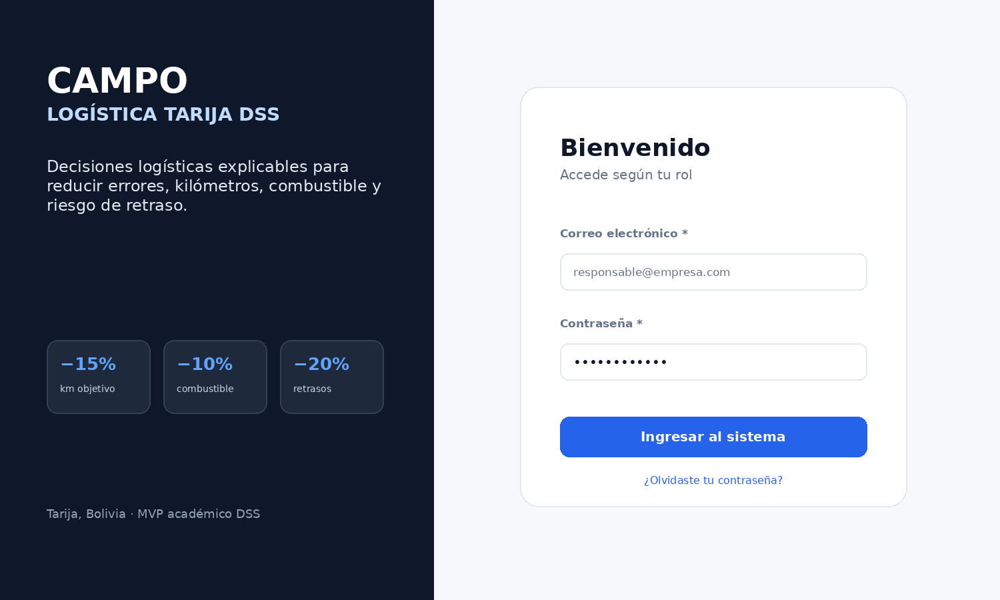
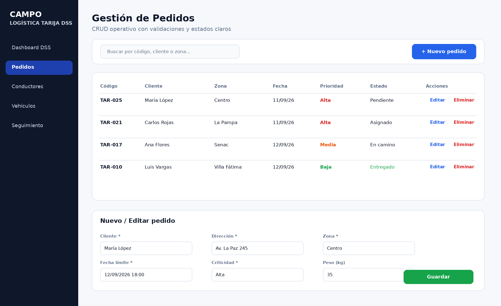
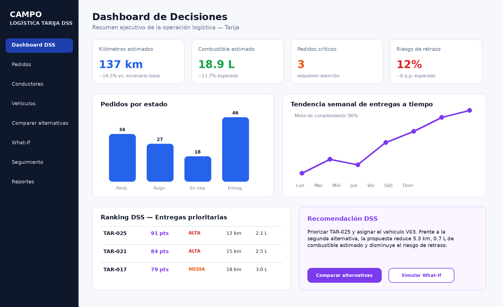
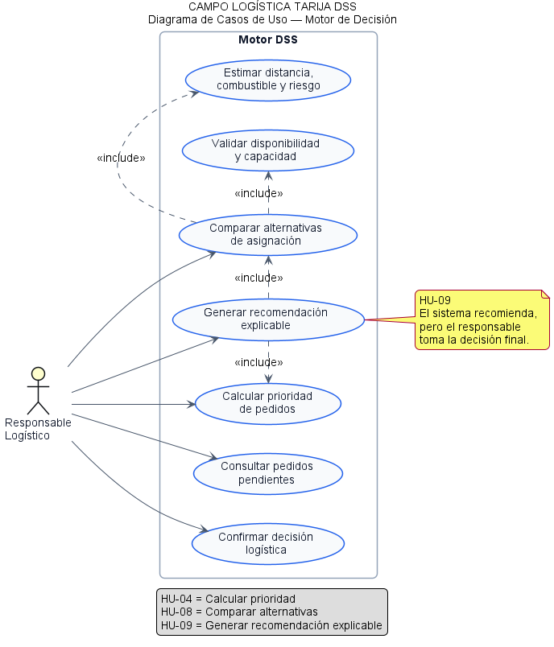
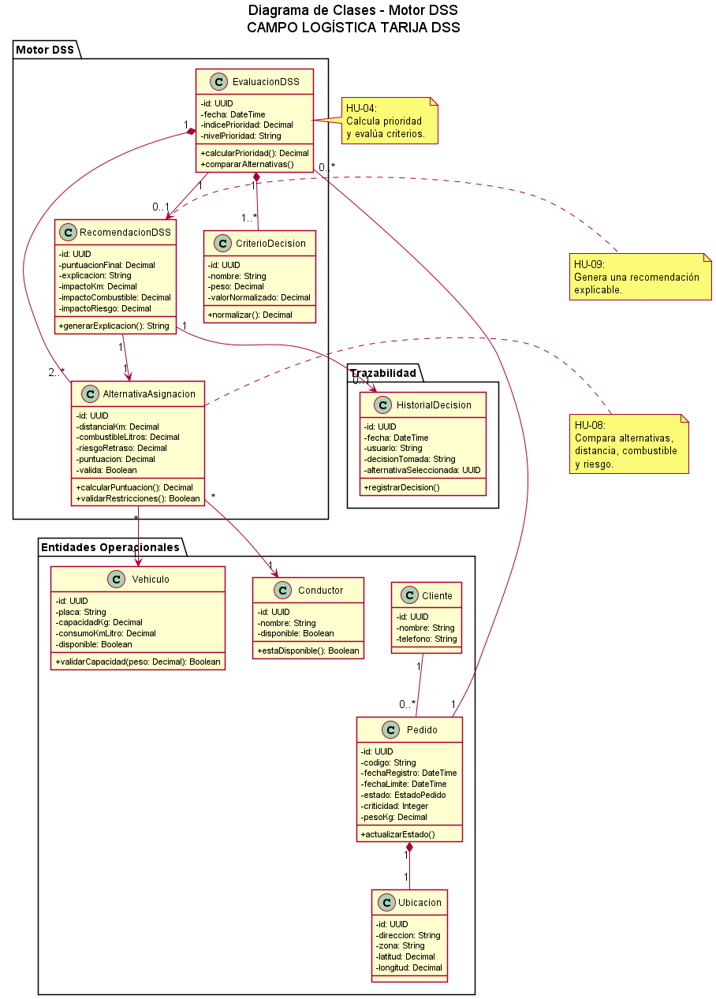
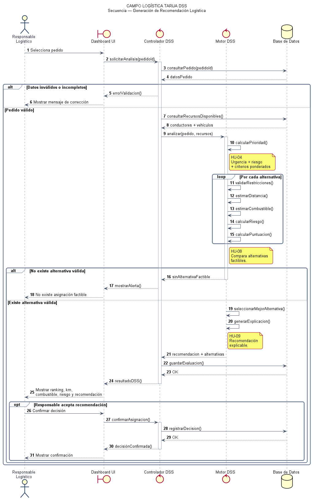

# CAMPO LOGÍSTICA TARIJA DSS

**Sistema de Soporte a Decisiones para la Gestión, Priorización y Optimización de Entregas en Tarija, Bolivia**

Proyecto académico desarrollado para la materia **Sistemas de Soporte a Decisiones (DSS)**.

---

## 1. Visión del producto

> Una interfaz limpia, intuitiva y libre de distracciones que transforma datos logísticos complejos en indicadores, alertas, comparaciones y recomendaciones explicables para tomar decisiones rápidas y fundamentadas.

## 2. Objetivo UX

Diseñar una experiencia consistente y de baja carga cognitiva que permita:

* al usuario operativo registrar y actualizar datos con rapidez y sin errores;
* al responsable logístico identificar en pocos segundos los pedidos críticos;
* comparar alternativas de asignación y recorrido;
* comprender el impacto esperado en kilómetros, combustible y riesgo de retraso;
* explorar escenarios mediante análisis **What-If** sin necesidad de conocer detalles técnicos del motor DSS.

---

## 3. User Personas

### Perfil 1 — Operativo: Despachador Logístico

**Objetivo:** ingresar y mantener información confiable con la menor cantidad de pasos posible.

**Necesidades:**

* formularios simples;
* campos obligatorios visibles;
* validación inmediata;
* prevención de duplicados;
* confirmación en acciones destructivas;
* tablas con búsqueda y filtros.

### Perfil 2 — Estratégico: Responsable Logístico

**Objetivo:** comprender la situación operativa y decidir qué alternativa conviene en menos de cinco segundos.

**Necesita ver:**

* pedidos críticos;
* riesgo de retraso;
* kilómetros estimados;
* consumo estimado de combustible;
* ranking de prioridad;
* comparación de alternativas;
* recomendación DSS y explicación;
* KPIs de desempeño.



---

## 4. Objetivos de interacción

| Pantalla                | Objetivo                                                       |
| ----------------------- | -------------------------------------------------------------- |
| Login                   | Acceder según rol de forma rápida y segura.                    |
| Pedidos                 | Registrar, consultar y actualizar pedidos sin errores.         |
| Conductores / Vehículos | Conocer disponibilidad y capacidad de los recursos.            |
| Dashboard DSS           | Detectar en segundos los casos que requieren atención.         |
| Comparar alternativas   | Evaluar distancia, combustible, riesgo y puntuación.           |
| What-If                 | Modificar condiciones y observar cómo cambia la recomendación. |
| Seguimiento             | Consultar estado, progreso y ubicación de la entrega.          |
| Reportes                | Revisar KPIs y resultados de las decisiones.                   |

---

## 5. Principios UX aplicados

* **Mínima sorpresa:** navegación y controles consistentes.
* **Revelación progresiva:** primero KPIs y alertas; los detalles aparecen al profundizar.
* **Prevención de errores:** validaciones visuales y confirmaciones.
* **Control del usuario:** el DSS recomienda; la persona decide.
* **Color funcional:** colores neutros para la interfaz y rojo/verde reservados para alertas o estados.
* **Accesibilidad:** texto legible y la información crítica no depende únicamente del color.
* **Drill-down:** desde un KPI o alerta se puede acceder al pedido o alternativa específica.

---

## 6. Arquitectura de navegación



**Flujo principal:**

`Login → Menú principal → CRUD / Dashboard DSS → Comparar alternativas / What-If / Seguimiento / Reportes`

---

## 7. Prototipos UX/UI

### Login



### CRUD de Pedidos



### Dashboard DSS



---

## 8. Diferencia entre CRUD y DSS

El CRUD mantiene los datos operativos de pedidos, clientes, conductores y vehículos.

El componente DSS utiliza esos datos para **analizar criterios, comparar alternativas, calcular prioridad y riesgo, estimar kilómetros y combustible y generar recomendaciones explicables** para el Responsable Logístico.

El sistema apoya la toma de decisiones, pero **la decisión final permanece bajo responsabilidad del usuario**.

---

## 9. KPIs principales

1. Porcentaje de errores de priorización y asignación.
2. Kilómetros totales y promedio por entrega.
3. Litros y costo estimado de combustible.
4. Porcentaje de entregas tardías.
5. Porcentaje de entregas a tiempo.
6. Cantidad de pedidos de prioridad alta.
7. Cantidad de entregas en riesgo.
8. Tasa de utilización de vehículos.

---

# 10. Arquitectura y Modelos

La arquitectura técnica de **CAMPO LOGÍSTICA TARIJA DSS** se documenta bajo el enfoque **Docs as Code**, utilizando PlantUML para mantener modelos textuales, versionables y trazables dentro del mismo repositorio.

Los modelos técnicos se concentran en las tres Historias de Usuario críticas que representan el núcleo del MVP DSS:

| Historia  | Funcionalidad                    | Propósito                                                                                            |
| --------- | -------------------------------- | ---------------------------------------------------------------------------------------------------- |
| **HU-04** | Calcular prioridad               | Determinar qué pedidos requieren atención primero.                                                   |
| **HU-08** | Comparar alternativas            | Evaluar diferentes posibilidades de asignación mediante distancia, combustible, riesgo y puntuación. |
| **HU-09** | Generar recomendación explicable | Recomendar la alternativa más conveniente y explicar los factores que justifican el resultado.       |

El flujo principal del núcleo DSS es:

`Datos → Priorización → Comparación de alternativas → Recomendación explicable → Decisión humana`

---

## 10.1 Diagrama de Casos de Uso

Representa la interacción del **Responsable Logístico** con las funcionalidades centrales del Motor DSS. El modelo muestra cómo el usuario puede calcular prioridades, comparar alternativas y obtener una recomendación antes de confirmar su decisión.



**Código fuente:** [`casos_uso_motor_dss.puml`](docs/uml/casos_uso_motor_dss.puml)

---

## 10.2 Diagrama de Clases

Representa las entidades operacionales y analíticas necesarias para soportar las historias críticas del MVP. Los pedidos, conductores y vehículos alimentan una evaluación DSS que compara alternativas utilizando criterios de decisión y produce una recomendación explicable.



**Código fuente:** [`clases_motor_dss.puml`](docs/uml/clases_motor_dss.puml)

---

## 10.3 Diagrama de Secuencia

Representa el flujo cronológico de la generación de una recomendación DSS desde el Dashboard hasta la Base de Datos y el Motor de Decisión. Incluye validaciones, comparación iterativa de alternativas, manejo de errores y confirmación opcional de la decisión.



**Código fuente:** [`secuencia_recomendacion_dss.puml`](docs/uml/secuencia_recomendacion_dss.puml)

---

## 10.4 Trazabilidad HU → Modelo técnico

| Historia | Caso de Uso                      | Clase principal | Operación principal    |
| -------- | -------------------------------- | --------------- | ---------------------- |
| HU-04    | Calcular prioridad               | `EvaluacionDSS` | `calcularPrioridad()`  |
| HU-08    | Comparar alternativas            | `Alternativa`   | `calcularPuntuacion()` |
| HU-09    | Generar recomendación explicable | `Recomendacion` | `generarExplicacion()` |

Esta trazabilidad permite mantener coherencia entre los requisitos funcionales del Product Backlog, los modelos arquitectónicos y la futura implementación del sistema.

---

## 10.5 Docs as Code

Los modelos PlantUML se almacenan en:

`/docs/uml`

Cada modelo conserva tanto su **código fuente `.puml`** como su representación visual exportada, permitiendo que los diagramas puedan modificarse, versionarse y revisarse mediante Git.

Estructura:

```text
docs/
└── uml/
    ├── casos_uso_motor_dss.puml
    ├── casos_uso_motor_dss.png
    ├── clases_motor_dss.puml
    ├── clases_motor_dss.png
    ├── secuencia_recomendacion_dss.puml
    └── secuencia_recomendacion_dss.png
```

---

## 11. Estructura del repositorio

```text
CAMPOLOGISTICA-DSS/
│
├── README.md
│
├── ux_strategy/
│   └── user_personas.png
│
├── diagrams/
│   └── navegacion_campo_logistica.png
│
├── prototypes/
│   ├── login.png
│   ├── crud_pedidos.png
│   └── dashboard_dss.png
│
└── docs/
    └── uml/
        ├── casos_uso_motor_dss.puml
        ├── casos_uso_motor_dss.png
        ├── clases_motor_dss.puml
        ├── clases_motor_dss.png
        ├── secuencia_recomendacion_dss.puml
        └── secuencia_recomendacion_dss.png
```

---

## 12. Enlaces del proyecto

**Repositorio:** CAMPOLOGISTICA-DSS

**Documentación técnica:** `/docs`

**Modelos PlantUML:** `/docs/uml`

---

## Tecnologías y herramientas

* PlantUML
* Git
* GitHub
* Figma
* Draw.io
* Visual Studio Code

---

**Proyecto académico — Sistemas de Soporte a Decisiones (DSS), 2026.**
